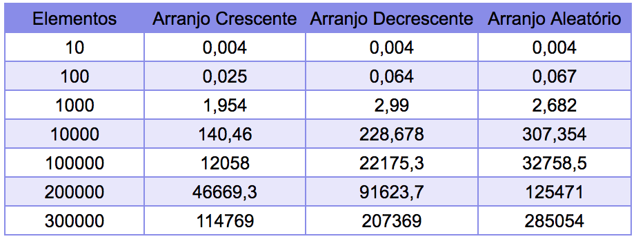
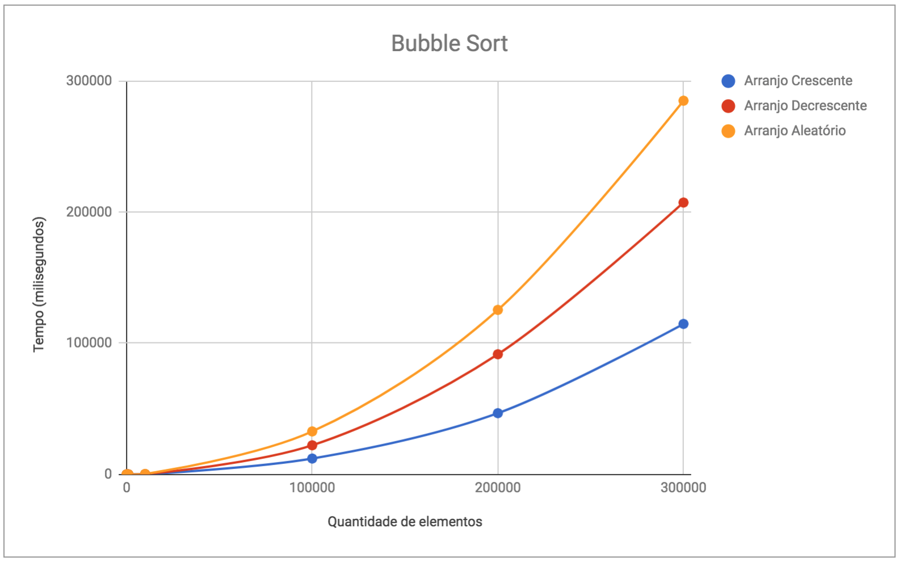
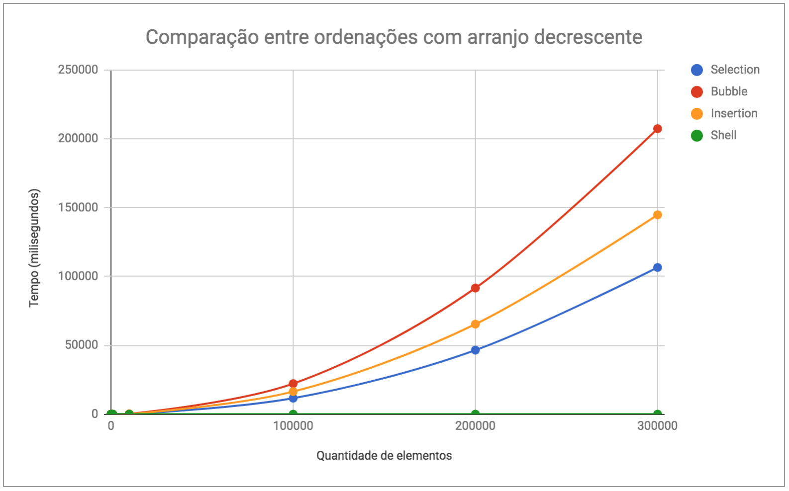

# Relatório
  Este relatório tem com objetivo fazer uma análise sobre os algorítomos de ordenação quadrática O(n^2). Para cada algorítomo é apresentado seu código, uma tabela com número de elementos criados e seu gráfico. Para uma análise mais completa, foi escolhido um arranjo ordenado crescente, um decrescente e um aleatório para ver seu comportamento nos diferentes casos.

## Selection Sort

```c
void selection_sort(int array[], int size) {
    for (int i = 0; i < size; ++i) {
        int min_i = i;

        for (int j = i + 1; j < size; ++j)
            if (array[j] < array[min_i]) min_i = j;

        if (i != min_i) {
            int swap_var = array[min_i];
            array[min_i] = array[i];
            array[i] = swap_var;
        }
    }
}
```
O selection sort não é estável, na maioria dos casos(existem casos que isso é sanado) e ocupa espaço em memória de O(1). Para comparações os selection sort faz a tarefa em O(n²) e a movimentação em O(n).


## Bubble Sort
```c
void bubble_sort(int array[], int size) {
    for (int i = 0; i < size - 1; ++i) {
        for (int j = 0; j < size - i - 1; ++j) {
            if (array[j] > array[j + 1]) {
                int swap_var = array[j];
                array[j] = array[j + 1];
                array[j + 1] = swap_var;
            }
        }
    }
}
```
O bubble Sort tem a vangtagem de ser estável, tadavia a comparação e movimentação em O(n²).





## Insertion Sort
```c
void insertion_sort(int array[], int size) {
  int i, j, key;
  for(i = 1; i < size; i++) {
    key = array[i];
    for(j = i; j > 0 && key < array[j-1]; j--) {
      array[j] = array[j-1];
    }
    array[j] = key;
  }
}
```
O insertion sort também é estável, mas tem aplicações mais especificas, pois ele se torna O(n) tanto em coparação quanto para inserção, no melhor caso. No caso médio e no pior caso a complexidade da comparação e inserção se torna O(n²).


## Shell Sort
```c
void shell_sort(int array[], int size) {
  int i, j, gap = 1, key;

  while(gap < size/3) {
    gap = gap * 3 + 1;
  }

  while(gap > 0) {
    for(i = 1; i < size; i++) {
      key = array[i];
      for(j = i; j >= gap && key < array[j-gap]; j -= gap) {
        array[j] = array[j-gap];
      }
      array[j] = key;
    }
    gap /= 3;
  }
}
```
O shell sort não é estável e tem uma complexidade aplicada para o ato de comparação aproximado em O(n^(1.25)) ou O(n(ln n)^2).


# Comparação entre Algorítmos

## Arranjo Crescente


## Arrajo Decrescente




## Arranjo Aleatório


Na maioria dos casos o Shell Sort se portou com maior velocidade, mas quando o arranjo já está ordenado em forma crescente o insertion sort é mais rápido.
